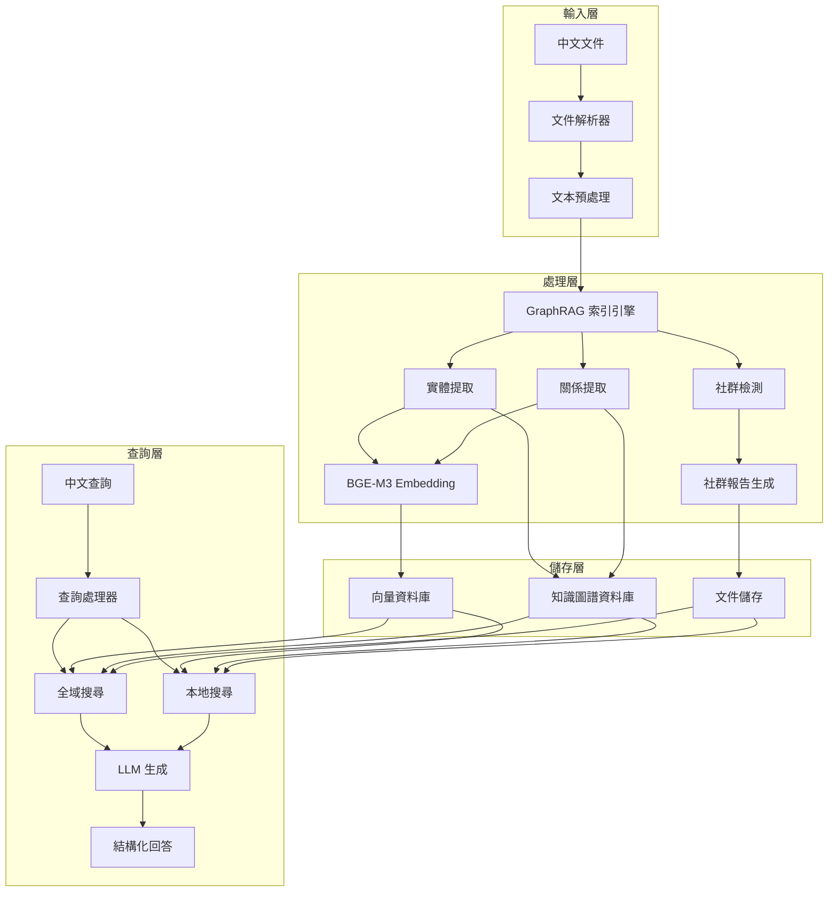

# 設計文件

## 概述

中文 GraphRAG 系統是一個基於 Microsoft GraphRAG 框架的知識圖譜檢索增強生成系統，專門針對中文文件處理進行優化。系統採用模組化架構，整合了中文 embedding 模型（BGE-M3）、向量資料庫儲存、以及完整的索引和查詢管道。

### 核心特性

- **多語言支援**：專門優化中文處理，同時保持多語言相容性
- **多功能檢索**：支援密集檢索、多向量檢索和稀疏檢索
- **知識圖譜**：自動建構實體關係圖譜和社群結構
- **向量化儲存**：持久化向量資料以提供高效檢索
- **靈活配置**：支援多種模型和資料庫配置選項

## 架構

### 系統架構圖



### 技術堆疊

- **程式語言**：Python 3.12
- **套件管理**：uv
- **核心框架**：Microsoft GraphRAG
- **Embedding 模型**：BGE-M3 (BAAI/bge-m3)
- **向量資料庫**：LanceDB (主要) / Chroma (備選)
- **圖形資料庫**：內建 Parquet 檔案系統
- **LLM 支援**：OpenAI GPT / Azure OpenAI / 本地模型

## 元件和介面

### 1. 文件處理模組 (DocumentProcessor)

**職責**：處理各種格式的中文文件輸入

```python
class DocumentProcessor:
    def __init__(self, supported_formats: List[str]):
        self.supported_formats = supported_formats
        self.text_splitter = ChineseTextSplitter()
    
    def process_document(self, file_path: str) -> List[TextChunk]:
        """處理單一文件並返回文本塊"""
        pass
    
    def batch_process(self, directory: str) -> List[Document]:
        """批次處理目錄中的所有文件"""
        pass
```

**支援格式**：
- `.txt` - 純文字檔案
- `.pdf` - PDF 文件
- `.docx` - Word 文件
- `.md` - Markdown 文件

### 2. 中文文本處理器 (ChineseTextProcessor)

**職責**：針對中文特性進行文本預處理

```python
class ChineseTextProcessor:
    def __init__(self):
        self.tokenizer = jieba
        self.stop_words = self._load_chinese_stopwords()
    
    def preprocess_text(self, text: str) -> str:
        """中文文本預處理"""
        pass
    
    def split_text(self, text: str, chunk_size: int = 1000) -> List[str]:
        """根據中文語言特性分割文本"""
        pass
```

### 3. BGE-M3 Embedding 服務 (BGEEmbeddingService)

**職責**：提供中文優化的向量化服務

```python
class BGEEmbeddingService:
    def __init__(self, model_name: str = "BAAI/bge-m3"):
        self.model = SentenceTransformer(model_name)
        self.device = self._get_device()
    
    def encode_texts(self, texts: List[str]) -> np.ndarray:
        """將文本編碼為向量"""
        pass
    
    def encode_queries(self, queries: List[str]) -> np.ndarray:
        """為查詢編碼向量（可能使用不同的策略）"""
        pass
```

### 4. 向量資料庫管理器 (VectorStoreManager)

**職責**：管理向量資料的儲存和檢索

```python
class VectorStoreManager:
    def __init__(self, store_type: str = "lancedb"):
        self.store = self._create_store(store_type)
        self.collections = {}
    
    def create_collection(self, name: str, dimension: int):
        """建立向量集合"""
        pass
    
    def insert_vectors(self, collection: str, vectors: np.ndarray, metadata: List[dict]):
        """插入向量資料"""
        pass
    
    def similarity_search(self, collection: str, query_vector: np.ndarray, k: int = 10):
        """相似性搜尋"""
        pass
```

### 5. GraphRAG 索引引擎 (GraphRAGIndexer)

**職責**：整合 GraphRAG 的索引流程

```python
class GraphRAGIndexer:
    def __init__(self, config: GraphRAGConfig):
        self.config = config
        self.embedding_service = BGEEmbeddingService()
        self.vector_store = VectorStoreManager()
    
    def index_documents(self, documents: List[Document]):
        """執行完整的索引流程"""
        pass
    
    def extract_entities_and_relationships(self, text_units: List[TextUnit]):
        """提取實體和關係"""
        pass
    
    def build_communities(self, entities: List[Entity], relationships: List[Relationship]):
        """建構社群結構"""
        pass
```

### 6. 查詢引擎 (QueryEngine)

**職責**：處理中文查詢並返回結構化結果

```python
class QueryEngine:
    def __init__(self, config: QueryConfig):
        self.global_search = GlobalSearchEngine(config)
        self.local_search = LocalSearchEngine(config)
        self.query_processor = ChineseQueryProcessor()
    
    def query(self, question: str, search_type: str = "auto") -> QueryResult:
        """執行查詢並返回結果"""
        pass
    
    def _determine_search_type(self, question: str) -> str:
        """自動判斷查詢類型"""
        pass
```

## 資料模型

### 1. 文件模型 (Document)

```python
@dataclass
class Document:
    id: str
    title: str
    content: str
    metadata: Dict[str, Any]
    file_path: str
    created_at: datetime
    language: str = "zh"
```

### 2. 文本單元模型 (TextUnit)

```python
@dataclass
class TextUnit:
    id: str
    text: str
    document_id: str
    chunk_index: int
    embedding: Optional[np.ndarray] = None
    metadata: Dict[str, Any] = field(default_factory=dict)
```

### 3. 實體模型 (Entity)

```python
@dataclass
class Entity:
    id: str
    name: str
    type: str
    description: str
    text_units: List[str]  # 關聯的文本單元 ID
    embedding: Optional[np.ndarray] = None
    community_id: Optional[str] = None
    rank: float = 0.0
```

### 4. 關係模型 (Relationship)

```python
@dataclass
class Relationship:
    id: str
    source_entity_id: str
    target_entity_id: str
    relationship_type: str
    description: str
    weight: float
    text_units: List[str]
```

### 5. 社群模型 (Community)

```python
@dataclass
class Community:
    id: str
    title: str
    level: int
    entities: List[str]  # 實體 ID 列表
    relationships: List[str]  # 關係 ID 列表
    summary: str
    full_content: str
    embedding: Optional[np.ndarray] = None
    rank: float = 0.0
```

## 錯誤處理

### 1. 文件處理錯誤

```python
class DocumentProcessingError(Exception):
    """文件處理相關錯誤"""
    pass

class UnsupportedFileFormatError(DocumentProcessingError):
    """不支援的檔案格式錯誤"""
    pass

class FileCorruptionError(DocumentProcessingError):
    """檔案損壞錯誤"""
    pass
```

### 2. Embedding 服務錯誤

```python
class EmbeddingServiceError(Exception):
    """Embedding 服務錯誤"""
    pass

class ModelLoadError(EmbeddingServiceError):
    """模型載入錯誤"""
    pass

class TokenLimitExceededError(EmbeddingServiceError):
    """Token 限制超出錯誤"""
    pass
```

### 3. 資料庫連線錯誤

```python
class DatabaseError(Exception):
    """資料庫相關錯誤"""
    pass

class ConnectionError(DatabaseError):
    """連線錯誤"""
    pass

class QueryTimeoutError(DatabaseError):
    """查詢超時錯誤"""
    pass
```

### 錯誤處理策略

1. **重試機制**：對於暫時性錯誤（如網路連線問題）實施指數退避重試
2. **降級處理**：當主要服務不可用時，提供基本功能
3. **錯誤記錄**：詳細記錄錯誤資訊以便除錯
4. **用戶友好提示**：將技術錯誤轉換為用戶可理解的訊息

## 測試策略

### 1. 單元測試

- **文件處理器測試**：測試各種檔案格式的解析
- **文本處理器測試**：測試中文分詞和預處理
- **Embedding 服務測試**：測試向量生成的正確性
- **資料庫操作測試**：測試 CRUD 操作

### 2. 整合測試

- **端到端索引測試**：測試完整的文件索引流程
- **查詢功能測試**：測試各種查詢場景
- **效能測試**：測試大量資料處理能力

### 3. 中文特定測試

- **中文文本處理測試**：測試繁體/簡體中文處理
- **中文查詢測試**：測試中文自然語言查詢
- **中文實體識別測試**：測試中文實體提取準確性

### 測試資料集

1. **小型測試集**：100 篇中文文件，用於快速驗證
2. **中型測試集**：1000 篇中文文件，用於效能測試
3. **領域特定測試集**：內部規定文件，用於實際場景驗證

### 測試自動化

```python
# 測試配置範例
class TestConfig:
    TEST_DATA_DIR = "tests/data"
    SMALL_DATASET_SIZE = 100
    MEDIUM_DATASET_SIZE = 1000
    PERFORMANCE_THRESHOLD = {
        "indexing_time_per_doc": 5.0,  # 秒
        "query_response_time": 2.0,    # 秒
        "memory_usage_mb": 1000        # MB
    }
```

### 持續整合

- **自動化測試**：每次程式碼提交時執行完整測試套件
- **效能監控**：追蹤關鍵效能指標的變化
- **品質閘門**：設定測試覆蓋率和效能基準線