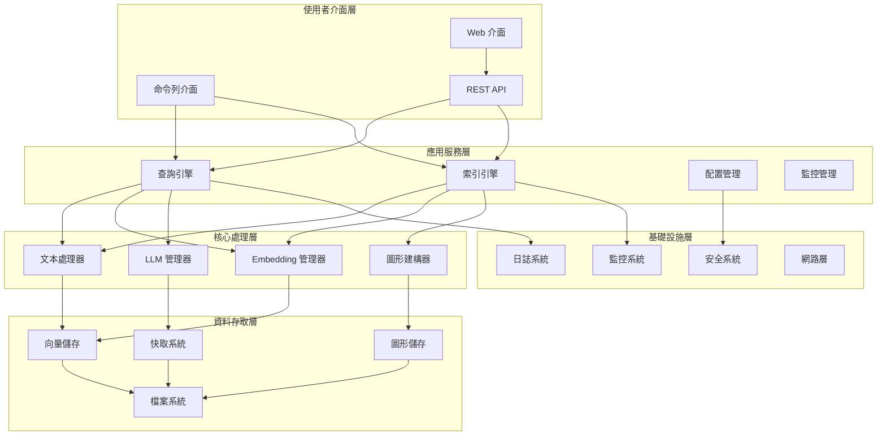
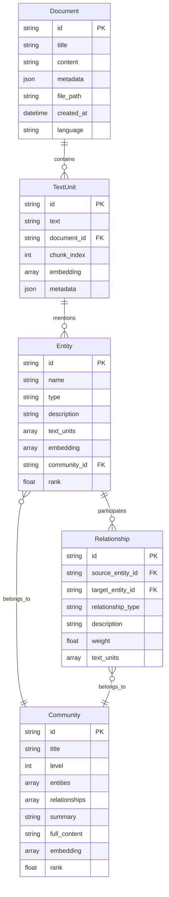
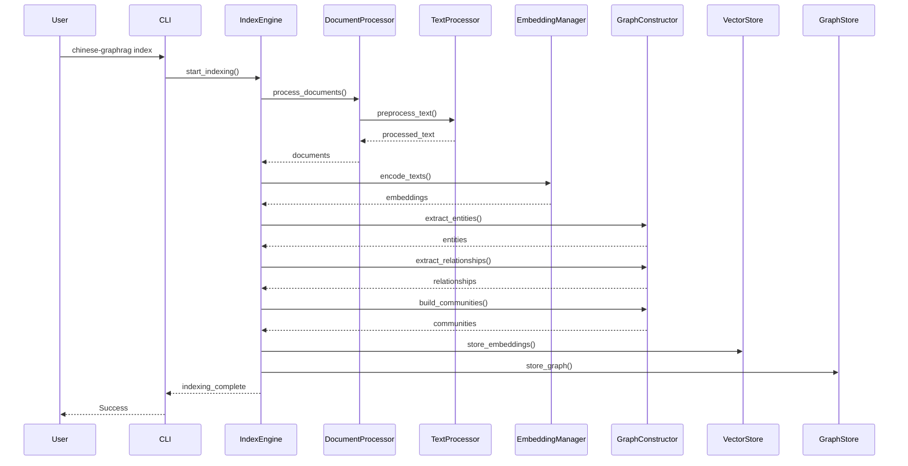
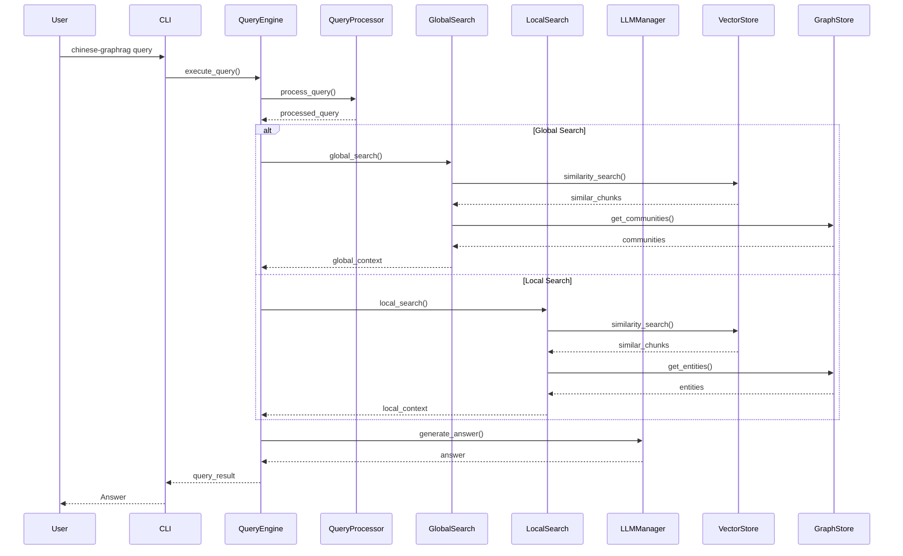

# 架構和設計文件

本文件詳細描述 Chinese GraphRAG 系統的架構設計、核心元件、資料流程和設計決策。

## 目錄

- [系統概述](#系統概述)
- [架構設計](#架構設計)
- [核心元件](#核心元件)
- [資料模型](#資料模型)
- [資料流程](#資料流程)
- [設計模式](#設計模式)
- [擴展性設計](#擴展性設計)
- [安全性設計](#安全性設計)
- [效能考量](#效能考量)
- [部署架構](#部署架構)

## 系統概述

### 系統目標

Chinese GraphRAG 系統是一個專門針對中文文件處理優化的知識圖譜檢索增強生成系統，主要目標包括：

- **中文優化**：提供專門針對中文語言特性的處理能力
- **知識圖譜**：自動建構實體關係圖譜和社群結構
- **檢索增強**：結合向量檢索和圖形檢索提供準確答案
- **多模型支援**：支援多種 LLM 和 Embedding 模型
- **高效能**：提供快速的索引和查詢能力

### 核心特性

- 🇨🇳 **中文語言優化**：專門的中文分詞、實體識別和語義理解
- 📊 **多層次檢索**：支援全域搜尋、本地搜尋和混合檢索
- 🔄 **多模型架構**：靈活的模型選擇和切換機制
- 💾 **持久化儲存**：向量資料庫和圖形資料庫整合
- ⚡ **效能優化**：智慧快取、批次處理和 GPU 加速
- 🛠️ **易於擴展**：模組化設計和插件架構

## 架構設計

### 整體架構圖



### 分層架構說明

#### 1. 使用者介面層

- **命令列介面 (CLI)**：提供完整的命令列操作
- **REST API**：標準的 HTTP API 介面
- **Web 介面**：基於瀏覽器的使用者介面

#### 2. 應用服務層

- **查詢引擎**：處理使用者查詢和生成回答
- **索引引擎**：處理文件索引和知識圖譜建構
- **配置管理**：系統配置和參數管理
- **監控管理**：系統監控和效能追蹤

#### 3. 核心處理層

- **文本處理器**：中文文本預處理和分析
- **Embedding 管理器**：向量化模型管理
- **LLM 管理器**：大語言模型管理
- **圖形建構器**：知識圖譜建構和管理

#### 4. 資料存取層

- **向量儲存**：向量資料庫管理
- **圖形儲存**：圖形資料庫管理
- **快取系統**：記憶體快取管理
- **檔案系統**：檔案存取管理

#### 5. 基礎設施層

- **日誌系統**：結構化日誌記錄
- **監控系統**：系統監控和告警
- **安全系統**：認證和授權
- **網路層**：網路通訊管理

## 核心元件

### 1. 文件處理器 (DocumentProcessor)

```python
class DocumentProcessor:
    """文件處理器基類"""
    
    def __init__(self, config: ProcessorConfig):
        self.config = config
        self.text_processor = ChineseTextProcessor()
        self.supported_formats = ['.txt', '.pdf', '.docx', '.md']
    
    def process_document(self, file_path: str) -> Document:
        """處理單一文件"""
        pass
    
    def batch_process(self, directory: str) -> List[Document]:
        """批次處理文件"""
        pass
```

**設計特點**：

- 支援多種文件格式
- 中文編碼自動檢測
- 錯誤處理和恢復機制
- 批次處理優化

### 2. 中文文本處理器 (ChineseTextProcessor)

```python
class ChineseTextProcessor:
    """中文文本處理器"""
    
    def __init__(self):
        self.tokenizer = jieba
        self.stop_words = self._load_chinese_stopwords()
        self.entity_recognizer = ChineseNER()
    
    def preprocess_text(self, text: str) -> str:
        """中文文本預處理"""
        pass
    
    def split_text(self, text: str, chunk_size: int = 1000) -> List[str]:
        """中文文本分塊"""
        pass
    
    def extract_entities(self, text: str) -> List[Entity]:
        """中文實體提取"""
        pass
```

**設計特點**：

- 專門的中文分詞策略
- 中文停用詞過濾
- 中文實體識別
- 語義邊界檢測

### 3. Embedding 管理器 (EmbeddingManager)

```python
class EmbeddingManager:
    """Embedding 模型管理器"""
    
    def __init__(self, config: EmbeddingConfig):
        self.config = config
        self.models = {}
        self.cache = EmbeddingCache()
        self.monitor = EmbeddingMonitor()
    
    def get_model(self, model_name: str) -> EmbeddingService:
        """獲取 Embedding 模型"""
        pass
    
    def encode_texts(self, texts: List[str], model_name: str = None) -> np.ndarray:
        """文本向量化"""
        pass
    
    def encode_queries(self, queries: List[str], model_name: str = None) -> np.ndarray:
        """查詢向量化"""
        pass
```

**設計特點**：

- 多模型支援和管理
- 智慧快取機制
- GPU 加速支援
- 使用量監控

### 4. 查詢引擎 (QueryEngine)

```python
class QueryEngine:
    """查詢引擎"""
    
    def __init__(self, config: QueryConfig):
        self.config = config
        self.global_search = GlobalSearchEngine(config)
        self.local_search = LocalSearchEngine(config)
        self.query_processor = ChineseQueryProcessor()
        self.llm_manager = LLMManager(config)
    
    def query(self, question: str, search_type: str = "auto") -> QueryResult:
        """執行查詢"""
        pass
    
    def batch_query(self, questions: List[str]) -> List[QueryResult]:
        """批次查詢"""
        pass
```

**設計特點**：

- 多種搜尋策略
- 智慧查詢路由
- 結果融合和排序
- 批次查詢優化

## 資料模型

### 1. 核心實體模型

```python
@dataclass
class Document:
    """文件模型"""
    id: str
    title: str
    content: str
    metadata: Dict[str, Any]
    file_path: str
    created_at: datetime
    language: str = "zh"

@dataclass
class TextUnit:
    """文本單元模型"""
    id: str
    text: str
    document_id: str
    chunk_index: int
    embedding: Optional[np.ndarray] = None
    metadata: Dict[str, Any] = field(default_factory=dict)

@dataclass
class Entity:
    """實體模型"""
    id: str
    name: str
    type: str
    description: str
    text_units: List[str]
    embedding: Optional[np.ndarray] = None
    community_id: Optional[str] = None
    rank: float = 0.0

@dataclass
class Relationship:
    """關係模型"""
    id: str
    source_entity_id: str
    target_entity_id: str
    relationship_type: str
    description: str
    weight: float
    text_units: List[str]

@dataclass
class Community:
    """社群模型"""
    id: str
    title: str
    level: int
    entities: List[str]
    relationships: List[str]
    summary: str
    full_content: str
    embedding: Optional[np.ndarray] = None
    rank: float = 0.0
```

### 2. 資料關係圖



## 資料流程

### 1. 索引流程



### 2. 查詢流程



## 設計模式

### 1. 策略模式 (Strategy Pattern)

用於不同的搜尋策略和模型選擇：

```python
class SearchStrategy(ABC):
    """搜尋策略抽象基類"""
    
    @abstractmethod
    def search(self, query: str, context: SearchContext) -> SearchResult:
        pass

class GlobalSearchStrategy(SearchStrategy):
    """全域搜尋策略"""
    
    def search(self, query: str, context: SearchContext) -> SearchResult:
        # 實作全域搜尋邏輯
        pass

class LocalSearchStrategy(SearchStrategy):
    """本地搜尋策略"""
    
    def search(self, query: str, context: SearchContext) -> SearchResult:
        # 實作本地搜尋邏輯
        pass
```

### 2. 工廠模式 (Factory Pattern)

用於建立不同類型的處理器和服務：

```python
class ProcessorFactory:
    """處理器工廠"""
    
    @staticmethod
    def create_processor(file_type: str) -> DocumentProcessor:
        if file_type == '.pdf':
            return PDFProcessor()
        elif file_type == '.docx':
            return DocxProcessor()
        elif file_type == '.txt':
            return TextProcessor()
        else:
            raise UnsupportedFileTypeError(f"不支援的檔案類型: {file_type}")
```

### 3. 觀察者模式 (Observer Pattern)

用於監控和事件處理：

```python
class EventObserver(ABC):
    """事件觀察者抽象基類"""
    
    @abstractmethod
    def update(self, event: Event) -> None:
        pass

class MetricsObserver(EventObserver):
    """指標觀察者"""
    
    def update(self, event: Event) -> None:
        # 更新指標
        pass

class LoggingObserver(EventObserver):
    """日誌觀察者"""
    
    def update(self, event: Event) -> None:
        # 記錄日誌
        pass
```

### 4. 裝飾器模式 (Decorator Pattern)

用於快取和監控：

```python
def cache_result(cache_key_func):
    """結果快取裝飾器"""
    def decorator(func):
        @wraps(func)
        def wrapper(*args, **kwargs):
            cache_key = cache_key_func(*args, **kwargs)
            if cache_key in cache:
                return cache[cache_key]
            
            result = func(*args, **kwargs)
            cache[cache_key] = result
            return result
        return wrapper
    return decorator

def monitor_performance(func):
    """效能監控裝飾器"""
    @wraps(func)
    def wrapper(*args, **kwargs):
        start_time = time.time()
        try:
            result = func(*args, **kwargs)
            return result
        finally:
            end_time = time.time()
            metrics.record_execution_time(func.__name__, end_time - start_time)
    return wrapper
```

## 擴展性設計

### 1. 插件架構

```python
class Plugin(ABC):
    """插件抽象基類"""
    
    @abstractmethod
    def initialize(self, config: Dict[str, Any]) -> None:
        pass
    
    @abstractmethod
    def execute(self, *args, **kwargs) -> Any:
        pass

class PluginManager:
    """插件管理器"""
    
    def __init__(self):
        self.plugins = {}
    
    def register_plugin(self, name: str, plugin: Plugin) -> None:
        self.plugins[name] = plugin
    
    def execute_plugin(self, name: str, *args, **kwargs) -> Any:
        if name in self.plugins:
            return self.plugins[name].execute(*args, **kwargs)
        raise PluginNotFoundError(f"插件 {name} 不存在")
```

### 2. 微服務架構支援

```python
class ServiceRegistry:
    """服務註冊中心"""
    
    def __init__(self):
        self.services = {}
    
    def register_service(self, name: str, endpoint: str) -> None:
        self.services[name] = endpoint
    
    def discover_service(self, name: str) -> str:
        return self.services.get(name)

class ServiceClient:
    """服務客戶端"""
    
    def __init__(self, registry: ServiceRegistry):
        self.registry = registry
    
    def call_service(self, service_name: str, method: str, data: Dict) -> Any:
        endpoint = self.registry.discover_service(service_name)
        # 實作服務呼叫邏輯
        pass
```

## 安全性設計

### 1. 認證和授權

```python
class AuthenticationManager:
    """認證管理器"""
    
    def authenticate(self, credentials: Dict[str, str]) -> Optional[User]:
        # 實作認證邏輯
        pass
    
    def generate_token(self, user: User) -> str:
        # 生成 JWT Token
        pass

class AuthorizationManager:
    """授權管理器"""
    
    def authorize(self, user: User, resource: str, action: str) -> bool:
        # 實作授權邏輯
        pass
```

### 2. 資料加密

```python
class EncryptionService:
    """加密服務"""
    
    def encrypt_data(self, data: bytes, key: bytes) -> bytes:
        # 實作資料加密
        pass
    
    def decrypt_data(self, encrypted_data: bytes, key: bytes) -> bytes:
        # 實作資料解密
        pass
```

## 效能考量

### 1. 快取策略

- **多層快取**：記憶體快取 + 磁碟快取
- **智慧失效**：基於時間和使用頻率的快取失效
- **分散式快取**：支援 Redis 等分散式快取系統

### 2. 並行處理

- **多執行緒處理**：I/O 密集型任務使用執行緒池
- **多程序處理**：CPU 密集型任務使用程序池
- **異步處理**：網路請求使用異步 I/O

### 3. 記憶體優化

- **分批處理**：大資料集分批處理
- **記憶體映射**：大檔案使用記憶體映射
- **垃圾回收**：主動記憶體管理

## 部署架構

### 1. 單機部署

```yaml
# docker-compose.yml
version: '3.8'
services:
  chinese-graphrag:
    image: chinese-graphrag:latest
    ports:
      - "8000:8000"
    volumes:
      - ./data:/app/data
      - ./config:/app/config
    environment:
      - GRAPHRAG_API_KEY=${GRAPHRAG_API_KEY}
```

### 2. 分散式部署

```yaml
# kubernetes deployment
apiVersion: apps/v1
kind: Deployment
metadata:
  name: chinese-graphrag
spec:
  replicas: 3
  selector:
    matchLabels:
      app: chinese-graphrag
  template:
    metadata:
      labels:
        app: chinese-graphrag
    spec:
      containers:
      - name: chinese-graphrag
        image: chinese-graphrag:latest
        ports:
        - containerPort: 8000
        env:
        - name: GRAPHRAG_API_KEY
          valueFrom:
            secretKeyRef:
              name: graphrag-secret
              key: api-key
```

### 3. 雲端部署

支援主要雲端平台：

- **AWS**: ECS, EKS, Lambda
- **Azure**: Container Instances, AKS, Functions
- **GCP**: Cloud Run, GKE, Cloud Functions

## 監控和可觀測性

### 1. 指標收集

```python
class MetricsCollector:
    """指標收集器"""
    
    def __init__(self):
        self.metrics = {}
    
    def record_counter(self, name: str, value: int = 1) -> None:
        # 記錄計數器指標
        pass
    
    def record_histogram(self, name: str, value: float) -> None:
        # 記錄直方圖指標
        pass
    
    def record_gauge(self, name: str, value: float) -> None:
        # 記錄儀表指標
        pass
```

### 2. 分散式追蹤

```python
class TracingManager:
    """追蹤管理器"""
    
    def start_span(self, operation_name: str) -> Span:
        # 開始追蹤 span
        pass
    
    def finish_span(self, span: Span) -> None:
        # 結束追蹤 span
        pass
```

這個架構設計文件提供了系統的完整技術視圖，為開發者理解和擴展系統提供了詳細的指導。
