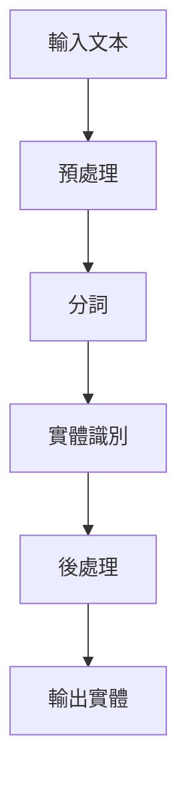

# 程式碼貢獻指南

歡迎參與 Chinese GraphRAG 專案的開發！本指南將協助您了解如何為專案做出貢獻。

## 目錄

- [開始之前](#開始之前)
- [開發環境設定](#開發環境設定)
- [程式碼規範](#程式碼規範)
- [提交流程](#提交流程)
- [測試指南](#測試指南)
- [文件撰寫](#文件撰寫)
- [問題回報](#問題回報)
- [功能請求](#功能請求)
- [程式碼審查](#程式碼審查)
- [發布流程](#發布流程)

## 開始之前

### 行為準則

參與本專案即表示您同意遵守我們的行為準則：

- **尊重他人**：以禮貌和專業的態度對待所有參與者
- **建設性溝通**：提供有建設性的反饋和建議
- **包容性**：歡迎不同背景和經驗水平的貢獻者
- **協作精神**：樂於分享知識和協助他人

### 貢獻類型

我們歡迎以下類型的貢獻：

- 🐛 **錯誤修復**：修復已知的程式錯誤
- ✨ **新功能**：實作新的功能和特性
- 📚 **文件改進**：改善文件品質和完整性
- 🧪 **測試增強**：增加測試覆蓋率和品質
- 🎨 **程式碼重構**：改善程式碼結構和可讀性
- 🔧 **工具改進**：改善開發工具和流程

## 開發環境設定

### 1. Fork 和 Clone 專案

```bash
# Fork 專案到您的 GitHub 帳號
# 然後 clone 到本地

git clone https://github.com/your-username/chinese-graphrag.git
cd chinese-graphrag

# 添加上游倉庫
git remote add upstream https://github.com/original-org/chinese-graphrag.git
```

### 2. 安裝開發依賴

```bash
# 安裝所有依賴（包括開發依賴）
uv sync --extra dev --extra docs

# 安裝 pre-commit hooks
uv run pre-commit install
```

### 3. 驗證環境設定

```bash
# 執行測試確保環境正常
uv run pytest

# 檢查程式碼格式
uv run black --check src/ tests/
uv run isort --check-only src/ tests/

# 執行類型檢查
uv run mypy src/
```

### 4. 建立開發分支

```bash
# 從 main 分支建立新的功能分支
git checkout -b feature/your-feature-name

# 或修復分支
git checkout -b fix/issue-number
```

## 程式碼規範

### 1. Python 程式碼風格

我們遵循 [PEP 8](https://pep8.org/) 和 [Black](https://black.readthedocs.io/) 程式碼格式：

```python
# 好的範例
class ChineseTextProcessor:
    """中文文本處理器。
    
    提供中文文本的預處理、分詞和實體識別功能。
    """
    
    def __init__(self, config: ProcessorConfig) -> None:
        """初始化處理器。
        
        Args:
            config: 處理器配置
        """
        self.config = config
        self.tokenizer = jieba
        self._stop_words = self._load_stop_words()
    
    def preprocess_text(self, text: str) -> str:
        """預處理中文文本。
        
        Args:
            text: 原始文本
            
        Returns:
            預處理後的文本
            
        Raises:
            ValueError: 當文本為空時
        """
        if not text.strip():
            raise ValueError("文本不能為空")
        
        # 移除多餘空白
        text = re.sub(r'\s+', ' ', text.strip())
        
        # 移除特殊字符
        text = re.sub(r'[^\w\s\u4e00-\u9fff]', '', text)
        
        return text
```

### 2. 命名規範

- **類別名稱**：使用 PascalCase（如 `ChineseTextProcessor`）
- **函數和變數**：使用 snake_case（如 `process_text`）
- **常數**：使用 UPPER_SNAKE_CASE（如 `MAX_CHUNK_SIZE`）
- **私有成員**：使用前綴底線（如 `_private_method`）

### 3. 類型提示

所有公開函數都必須包含類型提示：

```python
from typing import List, Optional, Dict, Any

def process_documents(
    documents: List[str],
    config: Optional[Dict[str, Any]] = None
) -> List[Document]:
    """處理文件列表。"""
    pass
```

### 4. 文檔字串

使用 Google 風格的文檔字串：

```python
def extract_entities(self, text: str, threshold: float = 0.8) -> List[Entity]:
    """從文本中提取實體。
    
    Args:
        text: 輸入文本
        threshold: 置信度閾值，預設為 0.8
        
    Returns:
        提取的實體列表
        
    Raises:
        ValueError: 當閾值不在 0-1 範圍內時
        
    Example:
        >>> processor = ChineseTextProcessor()
        >>> entities = processor.extract_entities("北京是中國的首都")
        >>> print(entities[0].name)
        '北京'
    """
    pass
```

### 5. 錯誤處理

使用適當的例外處理：

```python
# 自訂例外
class ChineseGraphRAGError(Exception):
    """基礎例外類別。"""
    pass

class ProcessingError(ChineseGraphRAGError):
    """處理錯誤。"""
    pass

# 使用範例
def process_file(file_path: str) -> Document:
    """處理檔案。"""
    try:
        with open(file_path, 'r', encoding='utf-8') as f:
            content = f.read()
    except FileNotFoundError:
        raise ProcessingError(f"檔案不存在: {file_path}")
    except UnicodeDecodeError:
        raise ProcessingError(f"檔案編碼錯誤: {file_path}")
    
    return Document(content=content)
```

## 提交流程

### 1. 程式碼提交

```bash
# 添加變更
git add .

# 提交變更（使用有意義的提交訊息）
git commit -m "feat: 添加中文實體識別功能

- 實作基於 jieba 的中文分詞
- 添加中文停用詞過濾
- 支援自訂實體類型
- 添加相關測試案例

Closes #123"
```

### 2. 提交訊息格式

使用 [Conventional Commits](https://www.conventionalcommits.org/) 格式：

```
<type>[optional scope]: <description>

[optional body]

[optional footer(s)]
```

**類型 (type)**：

- `feat`: 新功能
- `fix`: 錯誤修復
- `docs`: 文件變更
- `style`: 程式碼格式變更
- `refactor`: 程式碼重構
- `test`: 測試相關
- `chore`: 建置或輔助工具變更

**範例**：

```
feat(embedding): 添加 BGE-M3 模型支援

實作 BGE-M3 embedding 模型適配器，提供更好的中文語義理解能力。

- 添加 BGEEmbeddingService 類別
- 支援 GPU 加速
- 實作批次處理優化
- 添加模型快取機制

Closes #456
```

### 3. 推送變更

```bash
# 推送到您的 fork
git push origin feature/your-feature-name
```

### 4. 建立 Pull Request

1. 前往 GitHub 上的原始倉庫
2. 點擊 "New Pull Request"
3. 選擇您的分支
4. 填寫 PR 描述：

```markdown
## 變更摘要

簡要描述此 PR 的變更內容。

## 變更類型

- [ ] 錯誤修復
- [x] 新功能
- [ ] 文件更新
- [ ] 程式碼重構
- [ ] 測試改進

## 測試

- [x] 添加了新的測試案例
- [x] 所有現有測試通過
- [x] 手動測試通過

## 檢查清單

- [x] 程式碼遵循專案風格指南
- [x] 自我審查程式碼
- [x] 添加了適當的註解
- [x] 更新了相關文件
- [x] 變更不會破壞現有功能

## 相關 Issue

Closes #123
```

## 測試指南

### 1. 測試結構

```
tests/
├── unit/                    # 單元測試
│   ├── test_processors/
│   ├── test_embeddings/
│   └── test_query/
├── integration/             # 整合測試
│   ├── test_end_to_end.py
│   └── test_api.py
└── fixtures/                # 測試資料
    ├── sample_documents/
    └── test_config.yaml
```

### 2. 撰寫測試

```python
import pytest
from unittest.mock import Mock, patch

from chinese_graphrag.processors import ChineseTextProcessor
from chinese_graphrag.exceptions import ProcessingError


class TestChineseTextProcessor:
    """中文文本處理器測試。"""
    
    @pytest.fixture
    def processor(self):
        """建立處理器實例。"""
        config = Mock()
        return ChineseTextProcessor(config)
    
    def test_preprocess_text_success(self, processor):
        """測試文本預處理成功案例。"""
        # Arrange
        input_text = "  這是一個測試文本。  "
        expected = "這是一個測試文本"
        
        # Act
        result = processor.preprocess_text(input_text)
        
        # Assert
        assert result == expected
    
    def test_preprocess_text_empty_input(self, processor):
        """測試空文本輸入。"""
        # Arrange
        input_text = "   "
        
        # Act & Assert
        with pytest.raises(ValueError, match="文本不能為空"):
            processor.preprocess_text(input_text)
    
    @patch('chinese_graphrag.processors.jieba')
    def test_tokenize_text(self, mock_jieba, processor):
        """測試文本分詞。"""
        # Arrange
        mock_jieba.cut.return_value = ['這是', '一個', '測試']
        input_text = "這是一個測試"
        
        # Act
        result = processor.tokenize_text(input_text)
        
        # Assert
        assert result == ['這是', '一個', '測試']
        mock_jieba.cut.assert_called_once_with(input_text)
```

### 3. 執行測試

```bash
# 執行所有測試
uv run pytest

# 執行特定測試檔案
uv run pytest tests/unit/test_processors/test_chinese_text_processor.py

# 執行特定測試方法
uv run pytest tests/unit/test_processors/test_chinese_text_processor.py::TestChineseTextProcessor::test_preprocess_text_success

# 執行測試並生成覆蓋率報告
uv run pytest --cov=src/chinese_graphrag --cov-report=html

# 執行整合測試
uv run pytest tests/integration/ -m integration
```

### 4. 測試最佳實踐

- **AAA 模式**：Arrange（準備）、Act（執行）、Assert（斷言）
- **單一職責**：每個測試只測試一個功能點
- **獨立性**：測試之間不應相互依賴
- **可讀性**：測試名稱應清楚描述測試內容
- **Mock 使用**：適當使用 Mock 隔離外部依賴

## 文件撰寫

### 1. 文件類型

- **API 文件**：自動從程式碼生成
- **使用者指南**：面向終端使用者
- **開發者文件**：面向開發者
- **架構文件**：系統設計和架構

### 2. 文件格式

使用 Markdown 格式，遵循以下結構：

```markdown
# 標題

簡要描述文件內容。

## 目錄

- [章節1](#章節1)
- [章節2](#章節2)

## 章節1

內容...

### 子章節

內容...

## 範例

```python
# 程式碼範例
```

## 參考資料

- [連結1](url1)
- [連結2](url2)

```

### 3. 程式碼文件

```python
class ExampleClass:
    """範例類別。
    
    這是一個範例類別，展示如何撰寫良好的文件。
    
    Attributes:
        name: 名稱屬性
        value: 數值屬性
        
    Example:
        >>> example = ExampleClass("test", 42)
        >>> print(example.name)
        'test'
    """
    
    def __init__(self, name: str, value: int) -> None:
        """初始化範例類別。
        
        Args:
            name: 物件名稱
            value: 初始數值
            
        Raises:
            ValueError: 當 value 為負數時
        """
        if value < 0:
            raise ValueError("value 不能為負數")
        
        self.name = name
        self.value = value
```

## 問題回報

### 1. 搜尋現有問題

在建立新問題前，請先搜尋現有的 Issues 確認問題尚未被回報。

### 2. 建立問題報告

使用問題範本建立詳細的問題報告：

```markdown
## 問題描述

清楚簡潔地描述問題。

## 重現步驟

1. 執行 '...'
2. 點擊 '....'
3. 滾動到 '....'
4. 看到錯誤

## 預期行為

描述您預期應該發生什麼。

## 實際行為

描述實際發生了什麼。

## 螢幕截圖

如果適用，請添加螢幕截圖協助說明問題。

## 環境資訊

- 作業系統: [例如 macOS 12.0]
- Python 版本: [例如 3.11.0]
- 專案版本: [例如 0.1.0]

## 額外資訊

添加任何其他相關資訊。
```

## 功能請求

### 1. 功能請求範本

```markdown
## 功能描述

清楚簡潔地描述您希望的功能。

## 問題解決

這個功能解決了什麼問題？

## 建議解決方案

描述您希望如何實作這個功能。

## 替代方案

描述您考慮過的其他解決方案。

## 額外資訊

添加任何其他相關資訊或範例。
```

### 2. 功能設計文件

對於複雜功能，請提供設計文件：

```markdown
# 功能設計：中文實體識別增強

## 概述

改進中文實體識別的準確性和效能。

## 目標

- 提高中文實體識別準確率至 95%
- 支援更多實體類型
- 減少處理時間 50%

## 設計

### 架構變更



### API 變更

```python
def extract_entities(
    text: str,
    entity_types: List[str] = None,
    confidence_threshold: float = 0.8
) -> List[Entity]:
    pass
```

## 實作計劃

1. 研究現有中文 NER 模型
2. 實作新的實體識別器
3. 整合到現有系統
4. 撰寫測試
5. 更新文件

## 測試計劃

- 單元測試覆蓋率 > 90%
- 整合測試
- 效能基準測試

```

## 程式碼審查

### 1. 審查檢查清單

**功能性**：
- [ ] 程式碼實作了預期功能
- [ ] 邊界條件處理正確
- [ ] 錯誤處理適當

**程式碼品質**：
- [ ] 程式碼清晰易讀
- [ ] 命名有意義
- [ ] 函數職責單一
- [ ] 避免重複程式碼

**測試**：
- [ ] 有適當的測試覆蓋
- [ ] 測試案例完整
- [ ] 測試可靠且快速

**文件**：
- [ ] 程式碼有適當註解
- [ ] API 文件完整
- [ ] 變更記錄更新

### 2. 審查回饋

提供建設性的回饋：

```markdown
## 整體評價

程式碼實作了預期功能，整體品質良好。有幾個小建議：

## 具體建議

### 檔案：src/processors/chinese_text_processor.py

**第 45 行**：
```python
# 建議
def preprocess_text(self, text: str) -> str:
    """預處理文本，移除多餘空白和特殊字符。"""
    
# 而不是
def preprocess_text(self, text):
    # 處理文本
```

**理由**：添加類型提示和文檔字串提高程式碼可讀性。

### 檔案：tests/test_processors.py

**第 20 行**：建議添加邊界條件測試，例如空字串和特殊字符。

## 批准條件

- [ ] 修復類型提示問題
- [ ] 添加邊界條件測試
- [ ] 更新文檔字串

```

## 發布流程

### 1. 版本號規則

使用 [語義化版本](https://semver.org/)：

- **主版本號**：不相容的 API 變更
- **次版本號**：向後相容的功能新增
- **修訂版本號**：向後相容的錯誤修復

### 2. 發布檢查清單

- [ ] 所有測試通過
- [ ] 文件更新完成
- [ ] 變更記錄更新
- [ ] 版本號更新
- [ ] 標籤建立
- [ ] 發布說明撰寫

### 3. 發布命令

```bash
# 更新版本號
uv run bump2version minor  # 或 major, patch

# 建立標籤
git tag -a v0.2.0 -m "Release version 0.2.0"

# 推送標籤
git push origin v0.2.0

# 建立發布
gh release create v0.2.0 --title "Release 0.2.0" --notes-file CHANGELOG.md
```

## 社群參與

### 1. 討論區

- **GitHub Discussions**：一般討論和問答
- **Discord/Slack**：即時溝通
- **郵件列表**：重要公告

### 2. 會議和活動

- **每週開發會議**：週三 UTC+8 20:00
- **月度社群會議**：每月第一個週六
- **年度開發者大會**：分享最新進展

### 3. 認可和獎勵

- **貢獻者列表**：在 README 中列出所有貢獻者
- **特殊徽章**：為重要貢獻者提供特殊認可
- **年度獎項**：表彰傑出貢獻者

## 聯繫方式

如有任何問題或建議，請透過以下方式聯繫：

- **GitHub Issues**：技術問題和錯誤報告
- **GitHub Discussions**：一般討論和問答
- **電子郵件**：<maintainers@chinese-graphrag.org>
- **社群聊天**：[Discord 連結]

感謝您對 Chinese GraphRAG 專案的貢獻！🎉
