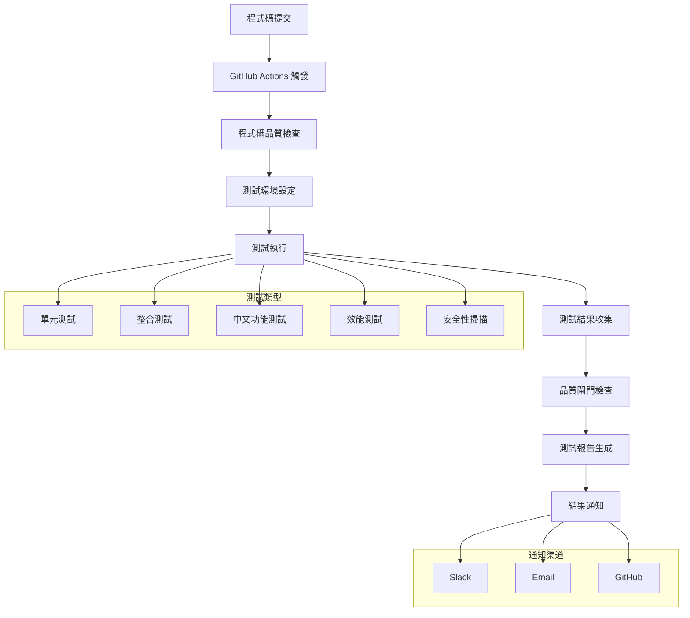

# 測試自動化系統文件

## 概述

Chinese GraphRAG 專案的測試自動化系統提供完整的持續整合和品質保證流程。系統包含測試資料管理、自動化測試執行、品質閘門檢查、測試報告生成和結果通知等功能。

## 架構設計

### 系統架構圖



### 核心元件

1. **測試資料管理器** (`scripts/test_data_manager.py`)
   - 管理測試所需的範例文件、配置檔案和測試夾具
   - 提供資料驗證和清理功能

2. **品質閘門檢查器** (`scripts/quality_gate.py`)
   - 檢查測試通過率、程式碼覆蓋率和其他品質指標
   - 根據預設閾值判斷是否通過品質閘門

3. **測試通知器** (`scripts/test_notifier.py`)
   - 支援多種通知渠道（Slack、Email、GitHub）
   - 根據測試結果和配置條件發送通知

4. **測試自動化執行器** (`scripts/run_test_automation.py`)
   - 整合所有測試自動化功能的主要執行腳本
   - 提供完整的測試管道執行流程

## 使用指南

### 快速開始

1. **設定測試環境**

   ```bash
   # 安裝依賴
   uv sync --dev
   
   # 初始化測試資料
   python scripts/init_test_data.py --reset
   ```

2. **執行完整測試管道**

   ```bash
   # 執行所有測試
   python scripts/run_test_automation.py
   
   # 執行特定類型的測試
   python scripts/run_test_automation.py --test-types unit integration
   
   # 跳過程式碼品質檢查
   python scripts/run_test_automation.py --skip-quality-checks
   ```

3. **單獨執行各個元件**

   ```bash
   # 品質閘門檢查
   python scripts/quality_gate.py --test-results-dir .
   
   # 生成測試報告
   python scripts/generate_test_report.py --format html,json
   
   # 發送通知
   python scripts/test_notifier.py --quality-gate-results quality-gate-results.json
   ```

### GitHub Actions 工作流程

專案使用 GitHub Actions 進行持續整合，工作流程檔案位於 `.github/workflows/ci.yml`。

#### 觸發條件

- 推送到 `main` 或 `develop` 分支
- 建立 Pull Request
- 每日定時執行（UTC 02:00）

#### 工作流程步驟

1. **程式碼品質檢查**
   - Black 格式檢查
   - isort 導入排序檢查
   - flake8 程式碼風格檢查
   - mypy 型別檢查

2. **單元測試**
   - 支援多個 Python 版本（3.11, 3.12）
   - 生成覆蓋率報告
   - 上傳到 Codecov

3. **整合測試**
   - 測試完整的索引和查詢流程
   - 包含外部服務整合測試

4. **中文功能測試**
   - 專門測試中文文本處理功能
   - 驗證中文 embedding 和查詢效果

5. **效能測試**
   - 僅在定時執行或包含 `[perf]` 標籤時執行
   - 生成效能基準報告

6. **安全性掃描**
   - 使用 Bandit 進行安全漏洞掃描

7. **測試報告生成**
   - 整合所有測試結果
   - 生成 HTML 和 JSON 格式報告

8. **品質閘門檢查**
   - 檢查所有品質指標
   - 決定是否通過品質閘門

## 配置說明

### 品質閘門配置 (`config/quality_gate.yaml`)

```yaml
# 品質閾值設定
thresholds:
  test_pass_rate: 90.0          # 測試通過率閾值 (%)
  code_coverage: 80.0           # 程式碼覆蓋率閾值 (%)
  integration_pass_rate: 85.0   # 整合測試通過率閾值 (%)
  chinese_test_pass_rate: 90.0  # 中文測試通過率閾值 (%)
  max_security_issues: 0        # 最大允許的安全問題數量

# 必要檢查項目
required_checks:
  - test_pass_rate
  - code_coverage
  - integration_tests
  - chinese_tests

# 可選檢查項目
optional_checks:
  - performance_tests
  - security_scan
```

### 通知配置

通知功能支援多種渠道和條件：

```yaml
notifications:
  enabled: true
  conditions:
    - on_failure      # 失敗時通知
    - on_success      # 成功時通知
  channels:
    slack:
      enabled: true
      webhook_url: "${SLACK_WEBHOOK_URL}"
    email:
      enabled: false
      recipients: ["dev-team@company.com"]
    github:
      enabled: true
      add_pr_comment: true
```

### 環境變數

測試自動化系統需要以下環境變數：

```bash
# OpenAI API (用於整合測試)
OPENAI_API_KEY=your_openai_api_key

# Azure OpenAI (可選)
AZURE_OPENAI_API_KEY=your_azure_api_key
AZURE_OPENAI_ENDPOINT=your_azure_endpoint

# 通知設定
SLACK_WEBHOOK_URL=your_slack_webhook_url
SMTP_SERVER=your_smtp_server
SMTP_USER=your_smtp_user
SMTP_PASSWORD=your_smtp_password

# GitHub (自動設定)
GITHUB_TOKEN=automatically_provided
GITHUB_REPOSITORY=automatically_provided
```

## 測試類型說明

### 單元測試

- **目標**: 測試個別函數和類別的功能
- **範圍**: `tests/` 目錄下的所有測試檔案（排除整合測試）
- **標記**: 使用 `pytest` 標記系統，排除 `integration` 和 `slow` 標記
- **覆蓋率**: 要求達到 80% 以上的程式碼覆蓋率

### 整合測試

- **目標**: 測試系統元件間的整合
- **範圍**: `tests/integration/` 目錄
- **標記**: 使用 `@pytest.mark.integration` 標記
- **特點**: 可能需要外部服務（如 OpenAI API）

### 中文功能測試

- **目標**: 專門測試中文文本處理功能
- **範圍**: 標記為 `@pytest.mark.chinese` 的測試
- **內容**: 中文分詞、embedding 生成、查詢處理等

### 效能測試

- **目標**: 監控系統效能和檢測效能回歸
- **工具**: 使用 `pytest-benchmark` 進行基準測試
- **觸發**: 定時執行或包含 `[perf]` 標籤的提交

## 品質指標

### 測試通過率

- **單元測試**: ≥ 90%
- **整合測試**: ≥ 85%
- **中文功能測試**: ≥ 90%

### 程式碼覆蓋率

- **整體覆蓋率**: ≥ 80%
- **核心模組覆蓋率**: ≥ 85%
- **測試覆蓋率報告**: 自動生成 HTML 和 XML 格式

### 效能指標

- **Embedding 生成時間**: < 1.0 秒
- **查詢回應時間**: < 0.5 秒
- **索引建立時間**: 根據文件數量動態調整

### 安全性指標

- **高風險安全問題**: 0 個
- **中風險安全問題**: ≤ 2 個
- **使用工具**: Bandit 靜態安全分析

## 報告和通知

### 測試報告

系統自動生成多種格式的測試報告：

1. **HTML 報告**: 包含詳細的視覺化結果
2. **JSON 報告**: 機器可讀的結構化資料
3. **文字摘要**: 簡潔的命令列輸出

報告內容包括：

- 測試結果摘要
- 覆蓋率詳情
- 效能基準測試結果
- 品質閘門檢查結果

### 通知機制

根據配置條件自動發送通知：

1. **Slack 通知**: 發送到指定頻道
2. **郵件通知**: 發送給開發團隊
3. **GitHub 通知**: PR 評論或建立 Issue

## 故障排除

### 常見問題

1. **測試環境設定失敗**

   ```bash
   # 重設測試資料
   python scripts/init_test_data.py --reset
   
   # 檢查依賴安裝
   uv sync --dev
   ```

2. **品質閘門檢查失敗**

   ```bash
   # 查看詳細結果
   python scripts/quality_gate.py --test-results-dir . --output quality-results.json
   
   # 檢查具體失敗項目
   cat quality-results.json | jq '.violations'
   ```

3. **通知發送失敗**

   ```bash
   # 檢查環境變數設定
   echo $SLACK_WEBHOOK_URL
   echo $GITHUB_TOKEN
   
   # 測試通知功能
   python scripts/test_notifier.py --quality-gate-results quality-gate-results.json
   ```

### 日誌和除錯

- **測試日誌**: 儲存在 `logs/` 目錄
- **覆蓋率報告**: 儲存在 `htmlcov/` 目錄
- **測試結果**: 儲存在 `test-reports/` 目錄

## 最佳實踐

### 撰寫測試

1. **使用描述性的測試名稱**

   ```python
   def test_chinese_text_processor_should_segment_chinese_text_correctly():
       pass
   ```

2. **適當使用測試標記**

   ```python
   @pytest.mark.chinese
   @pytest.mark.integration
   def test_chinese_embedding_integration():
       pass
   ```

3. **使用測試夾具**

   ```python
   def test_document_processing(sample_chinese_document):
       # 使用預定義的測試資料
       pass
   ```

### 維護測試資料

1. **定期更新測試資料**
2. **保持測試資料的多樣性**
3. **清理過時的測試檔案**

### 監控品質趨勢

1. **定期檢查覆蓋率趨勢**
2. **監控效能基準變化**
3. **追蹤品質閘門通過率**

## 擴展和自訂

### 添加新的測試類型

1. 在 `tests/` 目錄下建立新的測試檔案
2. 使用適當的 pytest 標記
3. 更新 CI 工作流程配置

### 自訂品質閾值

1. 修改 `config/quality_gate.yaml`
2. 根據專案需求調整閾值
3. 測試新的配置

### 添加新的通知渠道

1. 擴展 `scripts/test_notifier.py`
2. 實作新的通知方法
3. 更新配置檔案

## 參考資料

- [pytest 文件](https://docs.pytest.org/)
- [GitHub Actions 文件](https://docs.github.com/en/actions)
- [Codecov 整合](https://docs.codecov.com/)
- [Bandit 安全掃描](https://bandit.readthedocs.io/)

---

*此文件由 Chinese GraphRAG 開發團隊維護，最後更新：2024-12-20*
